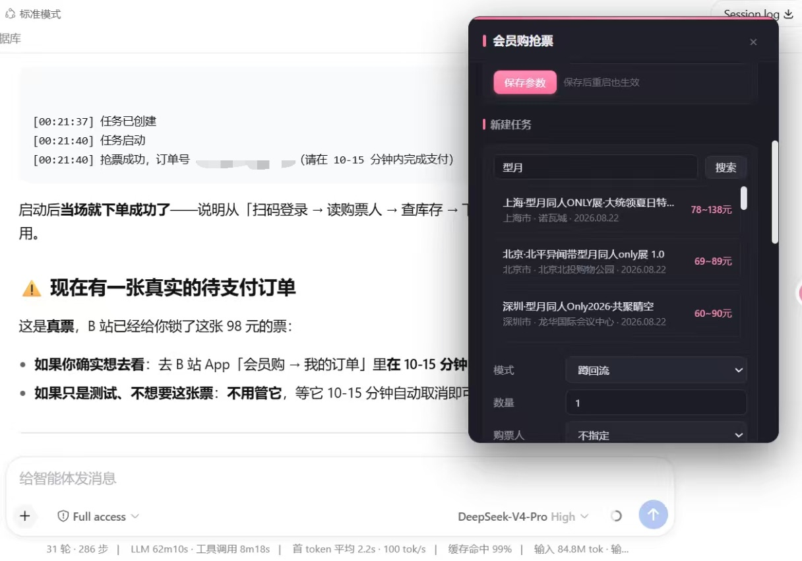

# dsh-bilibili-ticket

**A super-handy Bilibili 会员购 (membership purchase) ticketing project — highly recommended!**

A [DeepSeek Harness (DSH)](https://github.com/deepseek-ai/deepseek-harness) plugin for grabbing tickets at onsale and watching sold-out tiers for re-releases (回流), with everything delegatable to the AI for precise, hands-off results.

It ships a **draggable Web monitoring panel** (manual editing, show search, parameter tuning, log monitoring) and a **process-level ticketing engine** (background high-frequency ordering + stock polling) — so the DSH agent can search shows, inspect tiers, create tasks, watch for re-releases, and report status, all without leaving the chat or the panel.

> **Warning — compliance & risk**
> For personal use and study only. Automating ticket purchases may violate Bilibili's Terms of Service and ticket rules, and can lead to account risk-control, restriction, or bans. Scalping/reselling may also violate applicable law. Use at your own risk, keep request rates reasonable, and never bypass CAPTCHAs automatically — this plugin ships no CAPTCHA solver.

## Features

- **QR login** (recommended) — scan a QR code with the Bilibili App; the plugin completes login automatically (reads `SESSDATA` / `bili_jct` from the `Set-Cookie` response header). Cookie import is the fallback.
- **Search & inspect** — real keyword search (`show.bilibili.com/api/ticket/search/list`), plus tier / price / live-stock inspection.
- **Grab & monitor** — `grab` enters a high-frequency order storm at onsale; `monitor` polls stock and orders the moment a ticket returns (回流).
- **Per-task frequency + persistent tunables** — set polling / storm intervals per task (or globally); tunable parameters persist across restarts.
- **Web monitoring panel** — a draggable, Bilibili-pink themed panel: login status, live task list (start / stop / delete), streaming logs, parameter tuning, and search-to-create-task.

<p align="center">
  
  <br />
  <sub>Live demo（实机使用演示）</sub>
</p>

## Install

```bash
# Simplest: install straight from GitHub (auto clone + install deps)
dsh plugin --profile web add https://github.com/alingalingling/bilibili-ticketer.git
dsh web
```

`dsh web` is equivalent to `dsh --profile web`. Other install methods:

```bash
# From source
git clone https://github.com/alingalingling/bilibili-ticketer.git
cd bilibili-ticketer
pnpm install
dsh plugin --profile web add .

# Or a prebuilt tarball
dsh plugin --profile web add ./dsh-bilibili-ticket-0.1.19.tgz
```

The package declares `dsh.bundle.patch` in `package.json`, so `dsh plugin add` wires it into the profile's bundle stack automatically — no manual YAML needed. The engine boots once on the host plane and stays resident; the Web panel is served via the `dsh.client` manifest.

## Quick start

1. Install and restart DSH, then open the web UI.
2. Log in: tell the agent `帮我扫码登录会员购`, or open the panel (sidebar 「抢票」 button) and click 「扫码登录」.
3. Create a task: say `帮我搜「某某演唱会」，建一个蹲回流任务盯 480 元票档，数量 1` — or search → pick project → pick tier → create directly in the panel.
4. Watch progress in the panel (2s auto-refresh) or ask `任务进展如何？`.

## Tools

| Tool | Purpose |
| --- | --- |
| `bili_ticket_login_qr` | QR login (recommended) |
| `bili_ticket_login` | Import cookie & verify (fallback) |
| `bili_ticket_search` | Keyword search |
| `bili_ticket_detail` | Tiers / prices / stock |
| `bili_ticket_buyers` | List real-name buyers (masked) |
| `bili_ticket_task_create` | Create a grab / monitor task |
| `bili_ticket_tasks` | List tasks |
| `bili_ticket_task_start` / `stop` / `delete` | Control tasks |
| `bili_ticket_status` | Engine status & recent logs |

## Configuration

Optional `config` on the `bilibili-ticket` row (defaults shown):

| Key | Default | Meaning |
| --- | --- | --- |
| `dataDir` | `$DSH_HOME/bilibili-ticket` | Persistence directory (`state.json`) |
| `pollIntervalMs` | `3000` | Re-release polling interval |
| `stormLeadMs` | `2000` | Lead time before onsale to start the order storm |
| `stormIntervalMs` | `150` | Min interval between order attempts (jittered) |
| `orderTimeoutMs` | `60000` | Per-task grab / order timeout |
| `enabled` | `true` | Set `false` to disable the plugin |

## Project layout

```
lib/index.js     plugin entry (tools + guidance + engine lifecycle)
lib/client.js    会员购 HTTP client (endpoints, QR login, WBI, fingerprint, bili_ticket)
lib/engine.js    grab + re-release engine (scheduling / polling / ordering)
lib/rpc.js       host RPC channel for the Web panel (/bili-ticket)
lib/web.js       Web monitoring panel (client bundle)
lib/wbi.js       WBI signature
lib/state.js     JSON persistence (cookie / tasks / logs / tunables)
lib/util.js      helpers
lib/qr.js        QR PNG rendering
```

## API notes

The client targets the current 会员购 surface (`show.bilibili.com/api/ticket/*`): `search/list` (keyword), `project/getV2` / `get`, `stock/check`, `buyer/list`, `order/prepare`, `order/createV2`, `order/createstatus`. QR login uses `passport.bilibili.com/x/passport-login/web/qrcode/generate` + `poll`. WBI signing, `buvid3/4` fingerprint and `bili_ticket` (`GenWebTicket`) are implemented. The order-create payload and the local deterministic `token` are marked ⚠️ / 🔬 in the source as volatile reverse-engineered details that need live verification; `ctoken` / `feSign` / `deviceFingerprint` are documented gaps, not implemented.

## License & disclaimer

[MIT](./LICENSE). For study / research only — the user bears all responsibility for any actions and consequences resulting from use of this plugin.
